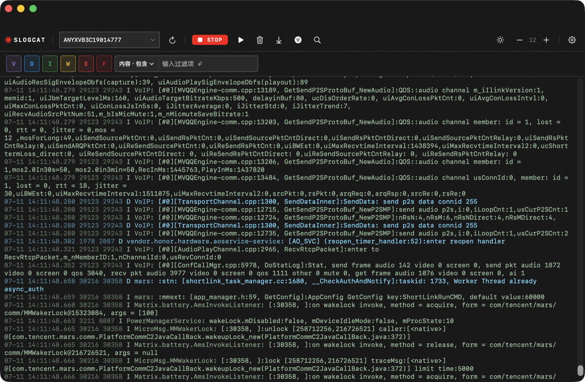
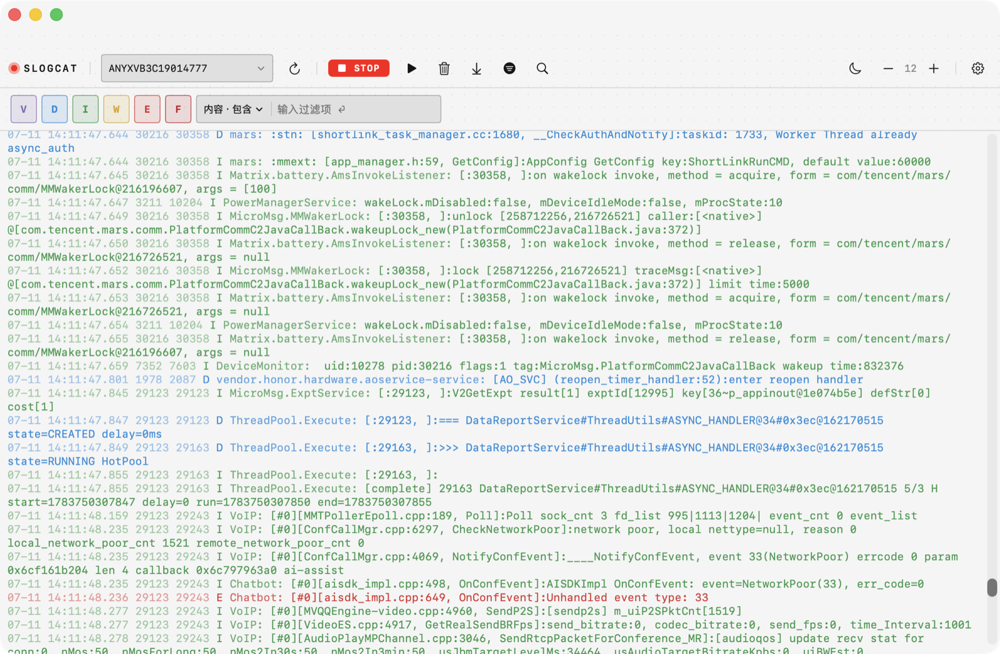

# slogcat

一个 macOS 端实时抓取 Android 日志的工具，提供过滤、屏蔽、搜索等功能。轻量高性能，适合不想为看日志而启动 Android Studio 的开发者。

## 截图

| 夜间模式 | 日间模式 |
| :---: | :---: |
|  |  |

## 环境要求

- macOS 14.0 (Sonoma) 或更高
- Xcode Command Line Tools（`xcode-select --install`）
- Android SDK platform-tools 中的 `adb`（自动检测 `~/Library/Android/sdk/platform-tools/adb`，也可在设置中手动指定路径）

## 功能

- 实时流式抓取 `adb logcat`，50ms 增量追加，滚动丝滑
- NSTextView + 环形缓冲区（默认 20000 行，可配置），零 diff 追加
- 后台 Actor 离线构建 NSAttributedString，主线程不卡顿
- 多规则过滤系统：内容/Tag 的包含/排除/正则，PID 精确匹配
- 排除优先级高于包含，包含之间为 OR 关系
- 实时搜索：增量扫描新追加文本，匹配数量/位置实时更新，跳转时锁定位置不被新日志冲走
- 日间/夜间双主题，Nothing-style 极简 UI
- 字体大小、最大显示行数、主题模式持久化
- 自定义应用图标，支持打包为 .app / .dmg

## 快速开始

### 源码运行

```bash
cd slogcat
swift run
```

### 编译 Release

```bash
swift build -c release
```

产物路径：`.build/release/Slogcat`

### 打包为 .app / .dmg

```bash
./build-app.sh
```

产物路径：
- `build/slogcat.app` — 可直接双击运行或拖入 Applications
- `build/slogcat.dmg` — DMG 安装包

`build-app.sh` 会自动完成：release 编译 → 组装 .app bundle（含 Info.plist + AppIcon.icns）→ ad-hoc 签名。如需生成 DMG：

```bash
cd build
hdiutil create -volname "slogcat" -srcfolder slogcat.app -ov -format UDZO slogcat.dmg
```

## 项目结构

```
slogcat/
├── Package.swift                  # SPM 包定义
├── build-app.sh                  # 打包脚本
├── Resources/
│   ├── AppIcon.icns              # 应用图标
│   └── Info.plist                # Bundle 配置
└── Sources/Slogcat/
    ├── SlogcatApp.swift           # @main 入口
    ├── Models.swift               # LogLevel / LogEntry / FilterRule
    ├── FilterEngine.swift         # 过滤规则编译与匹配
    ├── RingBuffer.swift           # 环形缓冲区
    ├── Components.swift           # LogConfig / DotGridBackground / 工具组件
    ├── Adb/
    │   ├── AdbProcess.swift       # adb 子进程封装 + 路径检测
    │   ├── DeviceManager.swift    # 设备列表
    │   └── LineParser.swift       # logcat 行解析
    ├── Core/
    │   ├── LogPipeline.swift      # 后台 Actor：解析+过滤+AttributedString 构建
    │   └── LogStore.swift         # @Observable UI 状态容器
    ├── Theme/
    │   └── LogTheme.swift         # 主题 + ThemeManager + TechField
    └── Views/
        ├── ContentView.swift      # 主视图 + Toolbar + 设置页
        ├── FilterPanel.swift      # 过滤器 UI + FlowLayout
        └── LogTextView.swift       # NSTextView 封装 + LogCoordinator
```

## 技术栈

- Swift 5.10+ / SwiftUI (macOS 14+)
- SPM executable target（无 Xcode 项目）
- NSTextView via NSViewRepresentable（绕过 SwiftUI List 性能瓶颈）
- `@Observable` + `@MainActor` 状态管理
- `actor LogPipeline` 后台离线构建
- UserDefaults 持久化配置

## 许可

MIT
